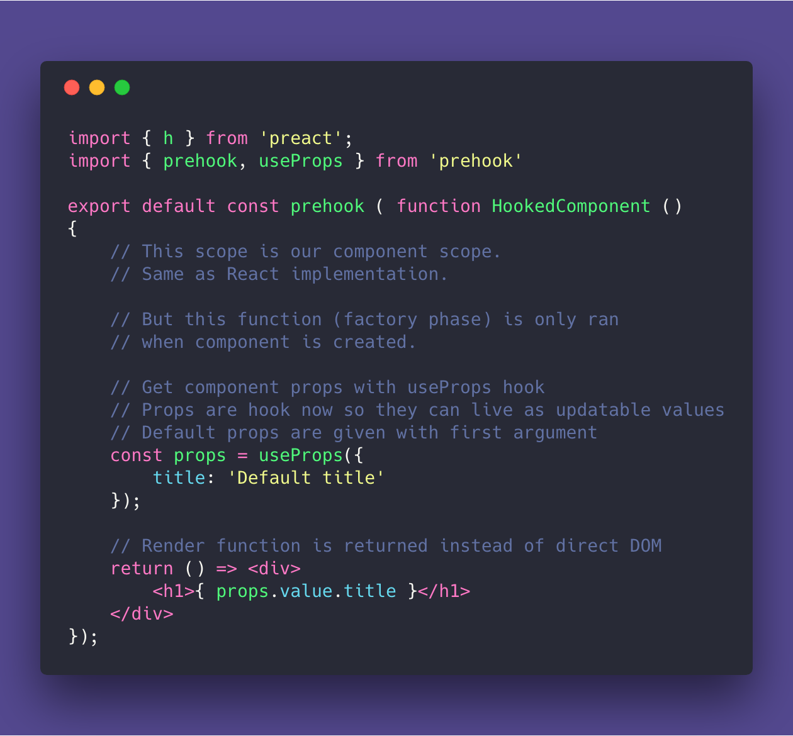
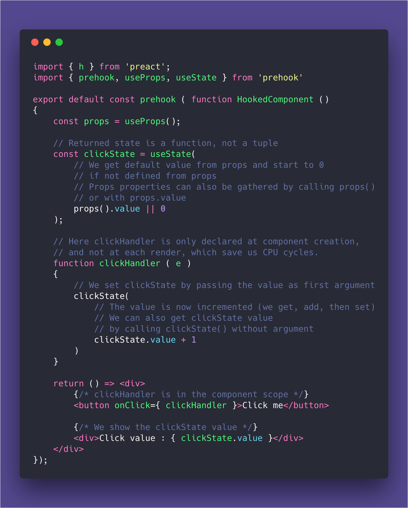
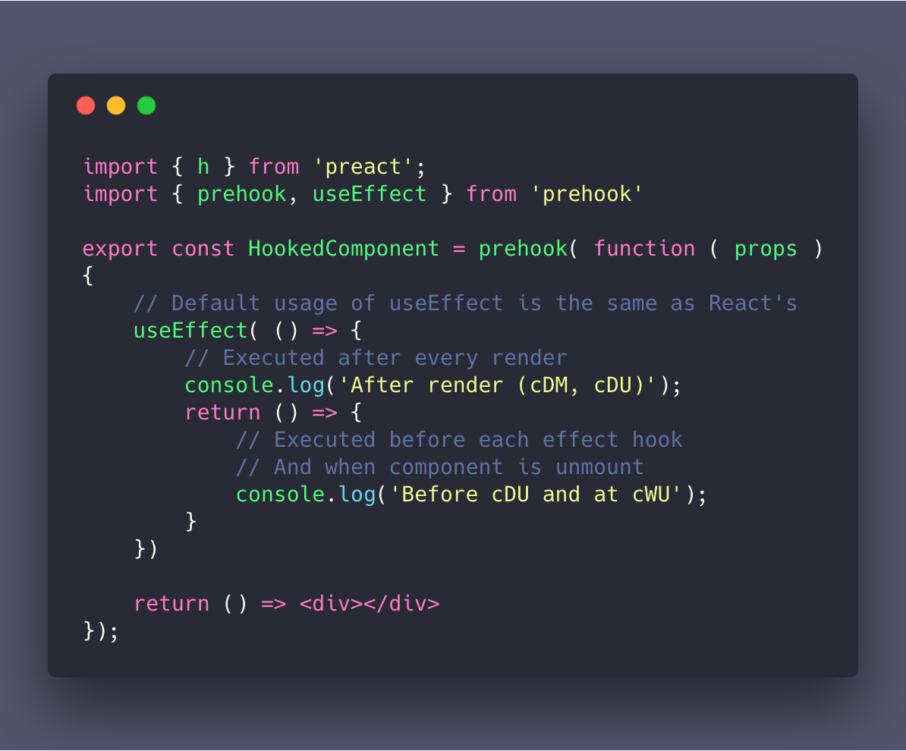
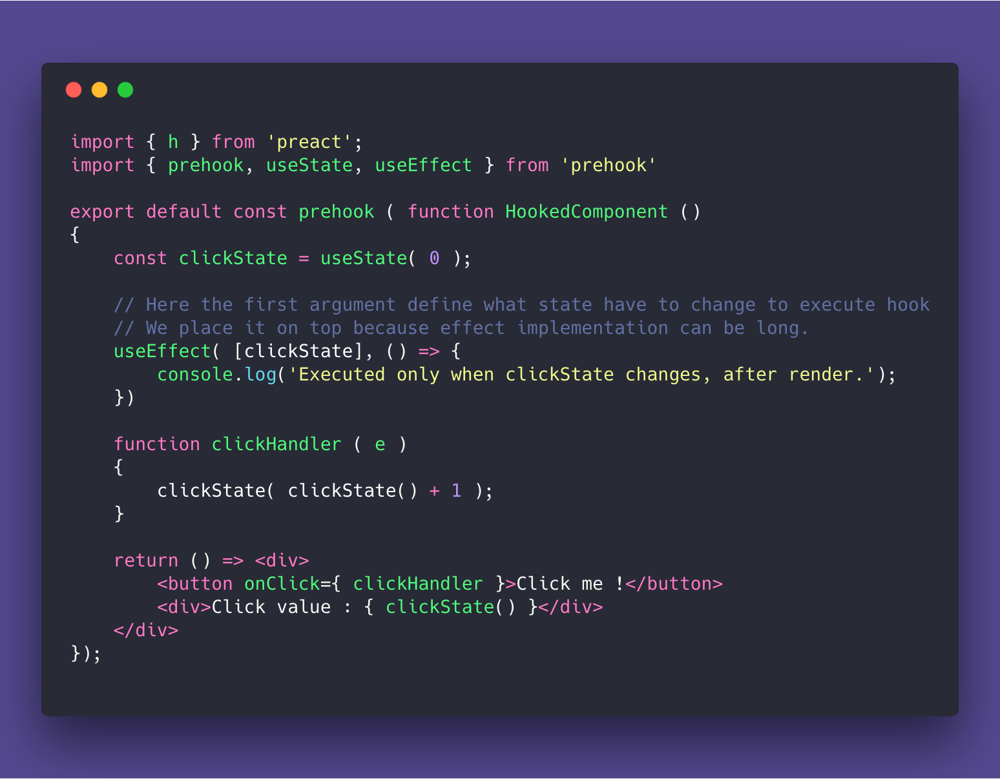

# Prehook (Preact + Hooks) Proof Of Concept
This is a proof of concept of a [React Hooks](https://reactjs.org/docs/hooks-reference.html) pattern but for [Preact](https://preactjs.com/).

## Important !
This is an early Proof of concept for a Hook implementation, **a bit different than the React approach**.

### Goal and motivation
1. This is for [Preact](https://preactjs.com/) and the goal is to maintain minimal output size, with maximal code flexibility and execution performaces.
2. I'm not 100% OK with the React Hooks proposal. To much hooks declared inside each render could, I think, lead to performances issues. These performaces issues does not exist with the Class system, so this is a drawback added by hooks we need to avoid.
React has a solution for patching performances with [`useMemoization`](https://reactjs.org/docs/hooks-reference.html#usememo) and [`useCallback`](https://reactjs.org/docs/hooks-reference.html#usecallback) hooks but this is not needed with this implementation.
3. Also, the ["don't use hooks in conditions"](https://youtu.be/dpw9EHDh2bM?t=1942) is a problem to me. It shows that there is to much "magic" going on under the hood. Which is not aviced when you dive into a new lib / way of thinking. People need to understands how it works so it's not frustrating and easy to learn. And to me, linters should not be mandatory to use a lib, syntax have to be expressive and clear.

### Size
For now the POC is **less than 3KB (not GZip)**, added to the Preact (10KB not GZIP) core with `useProps`, `useState`, `useEffect` and a better `useRef`.
This example is **16KB (not GZip)** with Preact + Prehook + working example.
I plan to add `useReducer` and `useContext` as separated files (like `useRef`).

### Differences
1. Components are still pure functions, but they have 2 phases : Factory and Render phases.
2. Components are not re-executed entierly at each render, they return a render function.
3. Hooks are initialized only at component build time, for better performances.
4. Hooks can be inside conditions as long they are inside component's factory phase.
5. `useState` have a slightly different API. With more functional approach.
6. Ref's are more usable with solo refs and multi-refs.
7. `useEffect` update condition are on top of the declaration, before implementation. Small diff but cleaner and more readable code.
8. Props are gathered and defaulted with `useProps` hook.

No need for React's [useMemo](https://reactjs.org/docs/hooks-reference.html#usememo) and [useCallback](https://reactjs.org/docs/hooks-reference.html#usecallback), which help keep our apps **fast and simple**.

### Future
This is built with Typescript for now and will be pre-compiled for npm when (if) ready.

I know that [Preact's author](https://github.com/developit) is working on a [Hooks implementation](https://twitter.com/_developit/status/1057426596779450368).
I also know that Preact goal is to mimic React API's so there is no much chances that is POC is used at anytime by anybody, this is just a proposal :)

Thanks !

## Some examples

The more important aspect of the lib, is the **Factory phase and Render phase**.
- **Factory phase** scope leak through all the component, but is called once.
- **Render phase** is called at each updates.

#### Factory and render

#### States differences.

#### Use effect example.

( There is an example of effect watching a prop below )

#### Use effect with optimized state example.

#### Custom hook

Here is a custom hook implementation example :
- [useWindowSize.ts](https://github.com/solid-js/prehook-proof-of-concept/blob/master/src/useWindowSize.ts)

And two usages of the same hook :
- [CustomHookComponent.tsx](https://github.com/solid-js/prehook-proof-of-concept/blob/master/src/CustomHookComponent.tsx)
- [CustomHookComponent2.tsx](https://github.com/solid-js/prehook-proof-of-concept/blob/master/src/CustomHookComponent2.tsx)

### Curious ?

- [See it in action !](https://solid-js.github.io/prehook-proof-of-concept/)

If you just want to check implementation without installing :
Example :
- [App.tsx](https://github.com/solid-js/prehook-proof-of-concept/blob/master/src/App.tsx)
- [HookedComponent.tsx](https://github.com/solid-js/prehook-proof-of-concept/blob/master/src/HookedComponent.tsx)

The lib :
- [prehook.ts](https://github.com/solid-js/prehook-proof-of-concept/blob/master/lib/prehook/prehook.ts)
- [useRef.ts](https://github.com/solid-js/prehook-proof-of-concept/blob/master/lib/prehook/useRef.ts)

## Installation

*Packages are installed automatically*

### Dev mode
Will watch files and check Typescript.
- `node solid` or `npm run dev`

### Build for production
- `node solid production` or `npm run build`
